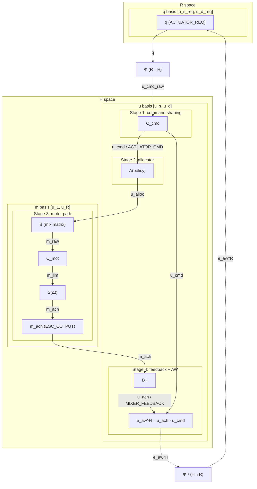

# Actuation command pipeline spec (V1.2 draft)

This document defines canonical notation and stage contracts for actuation.
The goal is unambiguous definitions for space, basis, stage, and transformation.

## Scope
- Applies to `AUTOPILOT` and `MANUAL` actuation paths
- Defines stage-by-stage inputs/outputs
- Defines spaces, bases, and basis changes
- Defines clamping operators and clamp points
- Defines canonical math symbols and software variable names

## Design goals
1. Use one naming convention across control, mixer, logging, telemetry, and simulation.
2. Keep one shared backend pipeline after source-specific shaping.
3. Keep separation of concerns:
   - command shaping (source feel/sensitivity)
   - feasibility and priority (allocator)
   - motor-side safety and enforcement (motor clamp/slew + ESC output)
4. Define anti-windup residuals with explicit space semantics.

## Conventions

### Spaces
| Space | Symbol | Meaning |
|---|---|---|
| Request space | $\mathcal{R}$ | Source-intent coordinates. Values are dimensionless and source-defined (for example, `MANUAL` is often mapped to `[-1,1]` per axis). |
| Hardware-normalized space | $\mathcal{H}$ | Actuator-relative command units. In motor basis $\mathbf{m}=[u_L,u_R]^\top$, $u_{L/R}=1$ is the per-motor upper hardware limit (lower limit is configuration-dependent). In surge/differential basis $\mathbf{u}=[u_s,u_d]^\top$, feasible bounds come from mapped motor limits and are basis-dependent. |

Notes:
- Exactly two spaces are used: $\mathcal{R}$ and $\mathcal{H}$.
- Limits/clamps define feasible subsets inside a space. They do not define a new space.
- Request-space bounds are part of a source contract; hard pre-allocation limits are enforced by command-stage envelopes in $\mathcal{H}$.
- Example (no reverse, motor bounds `[0,1]`): at fixed $u_s$, feasible differential satisfies $|u_d| \le \min(u_s,\ 1-u_s)$.

### Bases
| Basis | Space | Vector form | Meaning |
|---|---|---|---|
| Request surge/differential basis | $\mathcal{R}$ | $\mathbf{q}=[u_s^{req},\ u_d^{req}]^\top$ | Source-intent actuation coordinates |
| Surge/differential basis | $\mathcal{H}$ | $\mathbf{u}=[u_s,\ u_d]^\top$ | System-level actuation coordinates |
| Left/right motor basis | $\mathcal{H}$ | $\mathbf{m}=[u_L,\ u_R]^\top$ | Per-motor actuation coordinates |

Notes:
- A basis is a coordinate system inside a specific space, not a separate space.
- $\mathbf{q}$ is the request-space basis vector.
- $\mathbf{u}$ and $\mathbf{m}$ are hardware-space basis vectors.

### Stages
| Stage | Symbol | Output space | Output basis | Canonical software variables |
|---|---|---|---|---|
| Source request | $req$ | $\mathcal{R}$ | request surge/differential ($\mathbf{q}$) | `u_s_req`, `u_d_req` (`ACTUATOR_REQ`) |
| Command stage | $cmd$ | $\mathcal{H}$ | surge/differential | `u_s_cmd`, `u_d_cmd` (`ACTUATOR_CMD`) |
| Allocator stage | $alloc$ | $\mathcal{H}$ | surge/differential | `u_s_alloc`, `u_d_alloc` (optional diagnostics) |
| Motor raw stage | $raw$ | $\mathcal{H}$ | left/right | `u_L_raw`, `u_R_raw` (internal) |
| Motor achieved stage | $ach$ | $\mathcal{H}$ | left/right | `u_L_ach`, `u_R_ach` (internal or optional diagnostics) |
| Feedback stage | $ach$ | $\mathcal{H}$ | surge/differential | `u_s_ach`, `u_d_ach` (`MIXER_FEEDBACK`) |

Stage invariants:
- `req` is always in $\mathcal{R}$.
- `cmd`, `alloc`, `raw`, and `ach` are always in $\mathcal{H}$.

### Software naming rules
Use `<axis>_<stage>` for scalar fields.

| Concept | Canonical names |
|---|---|
| Request-space vector $\mathbf{q}$ | `u_s_req`, `u_d_req` as a paired request-stage representation |
| Request-stage surge/differential | `u_s_req`, `u_d_req` |
| Command-stage surge/differential | `u_s_cmd`, `u_d_cmd` |
| Allocator-stage surge/differential | `u_s_alloc`, `u_d_alloc` |
| Motor basis raw/achieved | `u_L_raw`, `u_R_raw`, `u_L_ach`, `u_R_ach` |
| Feedback-stage surge/differential achieved | `u_s_ach`, `u_d_ach` |

External interface exception:
- `ESC_OUTPUT` keeps unsuffixed motor fields `u_L`, `u_R` for interface stability.
- Semantically, `u_L` and `u_R` are motor-basis values in $\mathcal{H}$ at the final output/achieved stage.

## Transformations

### Basis change inside hardware-normalized space
From surge/differential to left/right:

```math
\mathbf{m} = \mathbf{B}\mathbf{u}, \quad
\mathbf{B} =
\begin{bmatrix}
1 & -1 \\
1 & 1
\end{bmatrix}
```

Inverse:

```math
\mathbf{u} = \mathbf{B}^{-1}\mathbf{m}, \quad
\mathbf{B}^{-1} = \frac{1}{2}
\begin{bmatrix}
1 & 1 \\
-1 & 1
\end{bmatrix}
```

### Request-to-command mapping

```math
\mathbf{u}^{cmd,raw} = \Phi_{mode}\!\left(\mathbf{q}\right),
\quad
\mathbf{q} = [u_s^{req}, u_d^{req}]^\top \in \mathcal{R}
```

### Clamping operators
Scalar clamp:

```math
\mathrm{clip}(x;\ell,h) = \min(\max(x,\ell), h)
```

Vector clamp applies scalar clamp componentwise.

Command-stage clamp in surge/differential basis:

```math
\mathbf{u}^{cmd} = C_{cmd}\!\left(\mathbf{u}^{cmd,raw}\right)
```

Motor-stage clamp in left/right basis:

```math
\mathbf{m}^{lim} = C_{mot}\!\left(\mathbf{m}^{raw}\right)
```

### End-to-end stage equations

```math
\mathbf{u}^{cmd,raw} = \Phi_{mode}\!\left(\mathbf{q}\right)
```

```math
\mathbf{u}^{cmd} = C_{cmd}\!\left(\mathbf{u}^{cmd,raw}\right)
```

```math
\mathbf{u}^{alloc} = \mathcal{A}\!\left(\mathbf{u}^{cmd};\ \text{policy}\right)
```

```math
\mathbf{m}^{raw} = \mathbf{B}\mathbf{u}^{alloc}
```

```math
\mathbf{m}^{lim} = C_{mot}\!\left(\mathbf{m}^{raw}\right)
```

```math
\mathbf{m}^{ach} = S\!\left(\mathbf{m}^{lim}, \mathbf{m}^{ach}_{k-1}, \Delta t\right)
```

```math
\mathbf{u}^{ach} = \mathbf{B}^{-1}\mathbf{m}^{ach}
```

## End-to-end diagram (Mermaid)



Diagram shorthand:
- Edge labels denote carried quantities.
- Transformation blocks denote operators (`Φ`, `C_cmd`, `A`, `B`, `C_mot`, `S`, `B⁻¹`, and optional `Φ⁻¹`).
- `Φ` is the cross-space mapping from request space `R` to hardware-normalized space `H`.
- Stage boxes group operators; they are not signal-carrying nodes.

## Pipeline definition

## Stage 0 - source generation
Purpose: produce request-stage actuation.

Inputs:
- `AUTOPILOT`: controller outputs mapped into request space
- `MANUAL`: RC channels mapped into request space

Output:
- $\mathbf{q}$ via `ACTUATOR_REQ`

Rules:
- No feasibility logic in this stage.
- No motor output write in this stage.
- Source modules define request-space scaling/bounds for their own outputs.

## Stage 1 - command shaping (mode-specific)
Purpose: map request space into hardware-normalized command stage.

Inputs:
- $\mathbf{q}$
- shaping parameters (`k_s`, `k_d`, deadband/expo settings)
- command envelopes

Output:
- $\mathbf{u}^{cmd}$ via `ACTUATOR_CMD`

Rules:
- Own source feel/sensitivity and command-stage envelope clamp.
- Expose enough local mapping information for anti-windup adaptation when needed.

## Stage 2 - allocator (policy + feasibility)
Purpose: enforce feasibility and priority in surge/differential basis.

Inputs:
- $\mathbf{u}^{cmd}$
- software and hardware limit settings
- allocator policy

Output:
- $\mathbf{u}^{alloc}$

Policy contract:
- `ALLOC_SPEED_PRIORITY`: preserve surge first, reduce differential as needed
- `ALLOC_YAW_PRIORITY`: preserve differential first, reduce surge as needed
- `ALLOC_WEIGHTED`: minimize weighted command error under constraints

## Stage 3 - basis change + motor clamp/slew
Purpose: convert to motor basis and enforce motor-side constraints.

Inputs:
- $\mathbf{u}^{alloc}$
- motor envelopes/bounds, trims, slew parameters

Operations:
1. Basis change to motor coordinates: $\mathbf{m}^{raw} = \mathbf{B}\mathbf{u}^{alloc}$
2. Apply trim/calibration
3. Clamp motor commands: $\mathbf{m}^{lim} = C_{mot}(\mathbf{m}^{raw})$
4. Apply slew/idle policy to get $\mathbf{m}^{ach}$

Outputs:
- `ESC_OUTPUT` from motor-stage achieved values
- optional motor diagnostics (`u_L_ach`, `u_R_ach`)

## Stage 4 - feedback reconstruction and anti-windup residual
Purpose: publish achieved command and saturation state.

Outputs:
- `MIXER_FEEDBACK`: `u_s_ach`, `u_d_ach`, `sat_L`, `sat_R`, `sat_any`
- optional diagnostics: stage saturation flags and effective limits

Control rule:
- Define anti-windup residual in hardware-normalized space:

```math
\mathbf{e}_{aw}^{\mathcal{H}} = \mathbf{u}^{ach} - \mathbf{u}^{cmd}
```

- Do not compare $\mathbf{u}^{ach}$ directly with $\mathbf{q}$ without mapping.

## Space mapping contract

Request-to-command mapping function:
- `act_space_req_to_cmd()`
- implements $\Phi_{mode}$

Command-to-request approximate inverse function:
- `act_space_cmd_to_req_approx()`
- implements $\Phi_{mode}^{-1,\mathrm{approx}}$

Per-cycle mapping context:
- `act_space_ctx_t`
  - effective local slopes/gains used this cycle
  - shaping-stage clamp/region flags
  - mode/source tag

Recommended controller-space adaptation:

```math
\mathbf{e}_{aw}^{\mathcal{R}} \approx
\Phi_{mode}^{-1,\mathrm{approx}}\!\left(\mathbf{e}_{aw}^{\mathcal{H}}\right)
```

In nonlinear/clamped regions this is a local approximation, not an exact global inverse.

## Limit and parameter conventions
| Category | Math symbol | Parameter names |
|---|---|---|
| Hardware motor bounds | $u_{LR,min}, u_{LR,max}$ | `act.hw.u_LR_min`, `act.hw.u_LR_max` |
| Software motor envelope | $u_{LR,min}^{sw}, u_{LR,max}^{sw}$ | `act.sw.u_LR_min`, `act.sw.u_LR_max` |
| Software surge envelope | $u_s^{min}, u_s^{max}$ | `act.sw.u_s_min`, `act.sw.u_s_max` |
| Software differential envelope | $u_{d,max}^{-}, u_{d,max}^{+}$ | `act.sw.u_d_max_neg`, `act.sw.u_d_max_pos` |

Mode scaling parameters:
| Mode | Math symbol | Parameter names |
|---|---|---|
| AUTOPILOT surge | $k_s^{ap}$ | `act.shp.ap.u_s_scale` |
| AUTOPILOT differential | $k_d^{ap}$ | `act.shp.ap.u_d_scale` |
| MANUAL surge | $k_s^{man}$ | `act.shp.man.u_s_scale` |
| MANUAL differential | $k_d^{man}$ | `act.shp.man.u_d_scale` |

## Invariants and validation rules
1. `act.hw.u_LR_min <= act.sw.u_LR_min <= act.sw.u_LR_max <= act.hw.u_LR_max`
2. `act.sw.u_d_max_neg >= 0` and `act.sw.u_d_max_pos >= 0`
3. `act.shp.*.u_s_scale >= 0` and `act.shp.*.u_d_scale >= 0`
4. `ACTUATOR_REQ` carries request-stage values in $\mathcal{R}$
5. `ACTUATOR_CMD` carries command-stage values in $\mathcal{H}$
6. Anti-windup residual is defined in $\mathcal{H}$

## Integration plan (documentation-first)
1. Keep this file as canonical naming reference.
2. Keep `control/overview.md` and `actuation/mixer_and_limits.md` aligned with these definitions.
3. Keep `interfaces/contracts.md` and `interfaces/dataflow.md` aligned with stage/topic contracts.
4. Add logging plan for optional allocator and motor-basis diagnostics.
5. Implement in code in small steps after doc alignment.

## Docs consistency check
A lightweight naming check exists:

```bash
python tools/check_docs_contracts.py
```

Current checker scope validates topic/stage names (`req/cmd/alloc/ach`) across:
- `docs/interfaces/contracts.md`
- `docs/interfaces/dataflow.md`
- `docs/actuation/mixer_and_limits.md`
